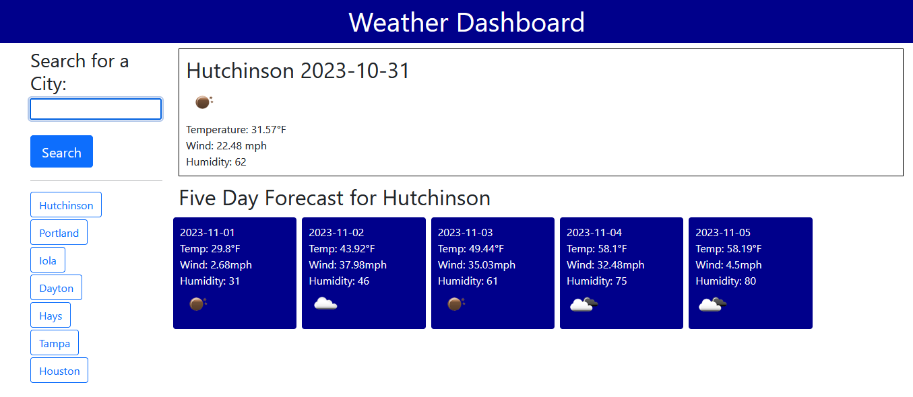

# Weather Planner

## Description

The goal of this project was to create an application that allows for users to view current and upcoming weather in various cities so they may plan accordingly. I used the OpenWeatherMaps Geocoding API to first convert the user's input into latitude and longitude, then plugged those into their 5 day forecast API to get that data as well. The application also stores the latitude and longitude of cities that are searched in localStorage so they may be easily accessed by the user.

## Installation

N/A

## Usage
The application can be viewed via [GitHubPages](https://whimsically.github.io/weather-planner) Users may search for a city to receive current weather and a 5 day forecast. The application then saves that city on the left side on the search bar so you may easily access it again. Simply click the city to pull the data back up. 

## Credits
Thanks to OpenWeatherMaps for their API, also Bootstrap!

## License

Please see license in github repo